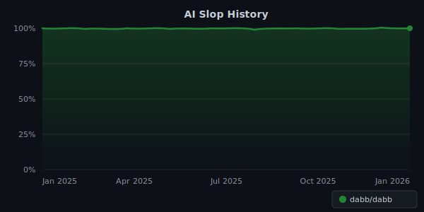

<div align="center">

# Dabb

### A Multiplayer Binokel Card Game

[](https://www.typescriptlang.org/)
[](https://react.dev/)
[](https://expo.dev/)
[](https://firebase.google.com/)
[](https://turbo.build/)
[](https://pnpm.io/)
[](https://vitest.dev/)
[](LICENSE)
[](#ai-slop-history)

_Play the traditional Swabian card game Binokel with friends online!_

[Play Now](#getting-started) | [Development](#development)

</div>

---

## What is Binokel?

**Binokel** (also known as _Binocle_) is a traditional German card game that originated in Swabia. It combines elements of trick-taking and melding, making it a strategic and engaging game for 2-4 players.

### Key Features

- **Real-time multiplayer** - Play with friends anywhere
- **AI opponents** - Add AI players to fill empty seats or practice solo
- **Cross-platform** - Web and Android support
- **Multi-language** - German and English UI (Swabian card terms preserved)
- **Event-sourced** - Reliable state management with reconnection support
- **Swabian dialect** - Authentic card names and terminology
- **AI slop** - Purely vibe coded - nix mit schaffe, schaffe, ...

### AI Slop History

<p align="center">
  
</p>

---

## FAQ

### "But that's not how we play it!"

Ah yes, the eternal Binokel debate. Every village, every family, every Stammtisch has their own "correct" rules. Your uncle swears the winning score is 1500. Your grandmother insists you need all four 10s for a valid meld. Your neighbor plays with a 48-card deck and looks at you like you're a heretic for doing otherwise.

Here's the thing: the rules implemented in this app are based on the one true tradition, passed down through generations of Swabian card players who definitely knew what they were doing. Any deviation you may have encountered in your life was simply... incorrect. We're sorry you had to find out this way.

**Common "variations" (read: mistakes) we've heard:**

| What you might think                   | The truth                                                                |
| -------------------------------------- | ------------------------------------------------------------------------ |
| "Winning score should be 1500!"        | 1000 is the correct threshold. Your games just lasted too long.          |
| "We play with 48 cards including 9s!"  | The 9 (Neun) was banished for being too weak. It knows what it did.      |
| "All four 10s should be a valid meld!" | No. The 10 already gets 10 points per trick. It doesn't need more glory. |
| "We call the Ober 'Unter'!"            | The Ober is above the Buabe. It's in the name. Geography matters.        |
| "Going out gives others 30 points!"    | It's 40. Your opponents deserve proper compensation for your cowardice.  |
| "The bid winner plays the first card!" | The player after the dealer leads — same one who started the bidding.    |

If your local rules differ, we respectfully suggest that your ancestors may have misheard the rules at some point, and the error has been propagated through generations. It happens to the best of us.

That said, feel free to open an issue if you want to argue. We enjoy reading passionate defenses of objectively wrong rule variants.

---

## Getting Started

### Play Online

Visit [dabb.degler.info](https://dabb.degler.info) to play instantly in your browser!

### Join a Game

1. Get a **game code** from the host (e.g., `schnell-fuchs-42`)
2. Enter your **nickname**
3. Click **Join Game**

### Create a Game

1. Click **New Game**
2. Choose **player count** (2, 3, or 4)
3. Enter your **nickname**
4. Share the **game code** with friends

### AI Players

Don't have enough friends online? Add AI players to fill empty seats:

1. In the **lobby**, click **Add AI Player**
2. The AI will join with a random name and play all phases automatically
3. You can mix human and AI players in any combination

The AI plays a reasonable game — it evaluates melds for bidding, chooses trump strategically, and follows trick-taking rules with card-counting heuristics. See [`docs/AI_STRATEGY.md`](docs/AI_STRATEGY.md) for details on its decision logic.

### Offline Mode

Want to practice without a server connection? The app also supports a fully offline single-player mode:

1. From the home screen, select **Play Offline**
2. Choose the **number of players** and **AI difficulty** (easy/medium/hard)
3. Play against AI opponents locally — no server, no account needed
4. Your game is automatically saved and can be resumed later

---

## Development

### Tech Stack

| Component | Technology                 |
| --------- | -------------------------- |
| Monorepo  | pnpm + Turborepo           |
| Backend   | Firebase Realtime Database |
| Client    | React Native + Expo        |
| Types     | TypeScript                 |

### Project Structure

```
dabb/
├── apps/
│   ├── client/     # React Native + Expo app (Android/iOS/web)
│   └── server/     # AI simulation CLI only (pnpm simulate)
├── packages/
│   ├── game-logic/     # Core game engine
│   ├── game-ai/        # AI player logic and offline game engine
│   ├── shared-types/   # TypeScript types
│   ├── game-canvas/    # Skia card table rendering
│   ├── ui-shared/      # Shared React hooks
│   ├── card-assets/    # Card graphics and constants
│   └── i18n/           # Internationalization
└── turbo.json
```

> **No application server.** The game backend is Firebase Realtime Database — clients connect directly. `apps/server` exists only for the `pnpm simulate` AI testing CLI.

### Prerequisites

- Node.js 22+
- pnpm 10+
- Firebase project with Realtime Database (for local development; see `DEPLOYMENT.md`)

### Installation

```bash
# Clone the repository
git clone https://github.com/your-username/dabb.git
cd dabb

# Install dependencies
pnpm install

# Build all packages
pnpm run build

# Run tests
pnpm test
```

### Development Server

```bash
# Start the client app (connects directly to Firebase RTDB — no local server needed)
pnpm --filter @dabb/client start
```

### Mobile Development on Android

The app uses `@shopify/react-native-skia` and `react-native-reanimated` v4, which are not reliably supported in Expo Go. A **custom development build** is required.

#### One-time setup: install the dev APK

**Option A — Docker + ADB (zero local setup):** Requires Docker and `adb` (Android platform-tools). No JDK or Android SDK needed.

```bash
./install-android.sh              # build via Docker, install on connected device
./install-android.sh --skip-build # reinstall without rebuilding
```

Enable USB debugging on your device and connect via USB before running.

**Option B — Local build:** Requires JDK 21 (see [DEPLOYMENT.md](DEPLOYMENT.md) → Local Android Development).

```bash
cd apps/client
npx expo run:android   # builds and installs directly on connected device/emulator
```

#### Daily workflow

```bash
pnpm --filter @dabb/client start
```

Open the installed dev build on your device — it will connect to Metro and load the JS bundle over your LAN. Subsequent JS changes hot-reload automatically without rebuilding the APK.

**Note:** Your phone and computer must be on the same WiFi network.

### Environment Variables

Create `apps/client/.env.local` with your Firebase project credentials:

```env
EXPO_PUBLIC_FIREBASE_API_KEY=...
EXPO_PUBLIC_FIREBASE_AUTH_DOMAIN=...
EXPO_PUBLIC_FIREBASE_DATABASE_URL=...
EXPO_PUBLIC_FIREBASE_PROJECT_ID=...
EXPO_PUBLIC_FIREBASE_STORAGE_BUCKET=...
EXPO_PUBLIC_FIREBASE_MESSAGING_SENDER_ID=...
EXPO_PUBLIC_FIREBASE_APP_ID=...
```

See `DEPLOYMENT.md` for Firebase project setup instructions.

---

## Architecture

The project uses **Firebase P2P** with **event sourcing** for reliable game state management:

1. All game actions are stored as **events** in Firebase Realtime Database
2. Clients read and write events directly — no application server intermediary
3. Game state is computed by **replaying events** through a reducer
4. **Reconnection** is handled by fetching and replaying all events from Firebase
5. **Client-side filtering** ensures players only see their own cards

See the [Architecture Documentation](docs/arc42/) for details.

---

## License

CC BY-NC 4.0 License - see [LICENSE](LICENSE) for details.

---

<div align="center">

Made with ♥ in Swabia

</div>
