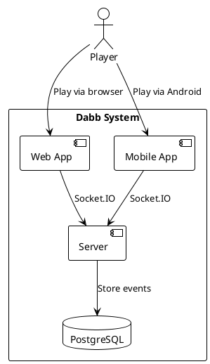
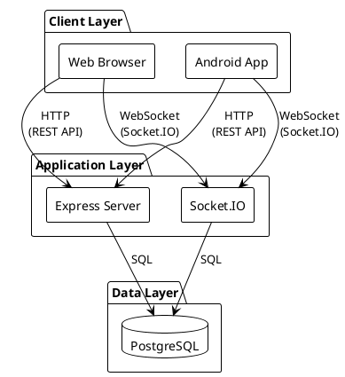

# 3. Context and Scope

## 3.1 Business Context

### Communication Partners

| Partner        | Interface         | Description               |
| -------------- | ----------------- | ------------------------- |
| Web Browser    | HTTPS + WebSocket | React SPA                 |
| Android Device | HTTPS + WebSocket | Expo app                  |
| PostgreSQL     | TCP/IP            | Event and session storage |

## 3.2 Technical Context

### Technical Interfaces

| Interface | Protocol   | Purpose                                      |
| --------- | ---------- | -------------------------------------------- |
| REST API  | HTTP/JSON  | Session management (create, join, reconnect) |
| WebSocket | Socket.IO  | Real-time game events                        |
| Database  | PostgreSQL | Persistent storage                           |
