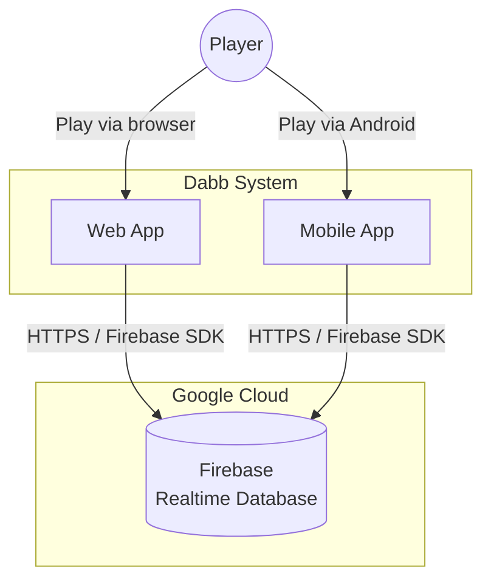
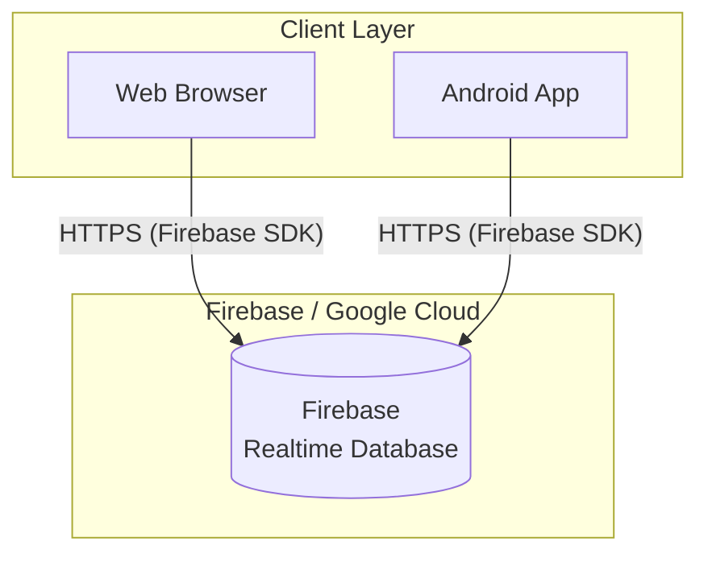

# 3. Context and Scope

## 3.1 Business Context

```mermaid
flowchart TB
    player((Player))

    subgraph dabb [Dabb System]
        web[Web App]
        mobile[Mobile App]
    end

    subgraph google [Google Cloud]
        firebase[(Firebase\nRealtime Database)]
    end

    player -->|Play via browser| web
    player -->|Play via Android| mobile
    web -->|HTTPS / Firebase SDK| firebase
    mobile -->|HTTPS / Firebase SDK| firebase
```

### Communication Partners

| Partner        | Interface            | Description                             |
| -------------- | -------------------- | --------------------------------------- |
| Web Browser    | HTTPS                | Expo/React web bundle (static hosting)  |
| Android Device | HTTPS                | Expo Android app                        |
| Firebase RTDB  | HTTPS / Firebase SDK | Append-only event log, session metadata |

## 3.2 Technical Context

```mermaid
flowchart TB
    subgraph client [Client Layer]
        web[Web Browser]
        android[Android App]
    end

    subgraph data [Firebase / Google Cloud]
        rtdb[(Firebase\nRealtime Database)]
    end

    web -->|"HTTPS (Firebase SDK)"| rtdb
    android -->|"HTTPS (Firebase SDK)"| rtdb
```

### Technical Interfaces

| Interface     | Protocol             | Purpose                                        |
| ------------- | -------------------- | ---------------------------------------------- |
| Firebase RTDB | HTTPS / Firebase SDK | Real-time event log: game events, session meta |
