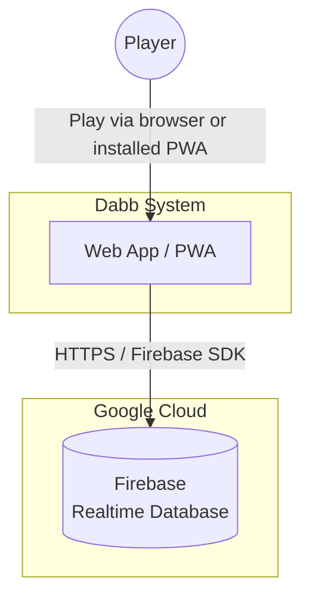
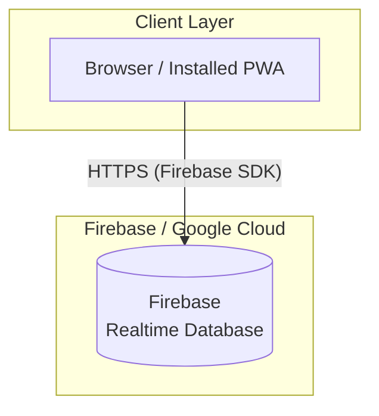

# 3. Context and Scope

## 3.1 Business Context

```mermaid
flowchart TB
    player((Player))

    subgraph dabb [Dabb System]
        web[Web App / PWA]
    end

    subgraph google [Google Cloud]
        firebase[(Firebase\nRealtime Database)]
    end

    player -->|Play via browser or installed PWA| web
    web -->|HTTPS / Firebase SDK| firebase
```

### Communication Partners

| Partner       | Interface            | Description                                                                 |
| ------------- | -------------------- | --------------------------------------------------------------------------- |
| Browser / PWA | HTTPS                | React/Vite web bundle (static hosting); installable to a device home screen |
| Firebase RTDB | HTTPS / Firebase SDK | Append-only event log, session metadata                                     |

## 3.2 Technical Context

```mermaid
flowchart TB
    subgraph client [Client Layer]
        web[Browser / Installed PWA]
    end

    subgraph data [Firebase / Google Cloud]
        rtdb[(Firebase\nRealtime Database)]
    end

    web -->|"HTTPS (Firebase SDK)"| rtdb
```

### Technical Interfaces

| Interface     | Protocol             | Purpose                                        |
| ------------- | -------------------- | ---------------------------------------------- |
| Firebase RTDB | HTTPS / Firebase SDK | Real-time event log: game events, session meta |
