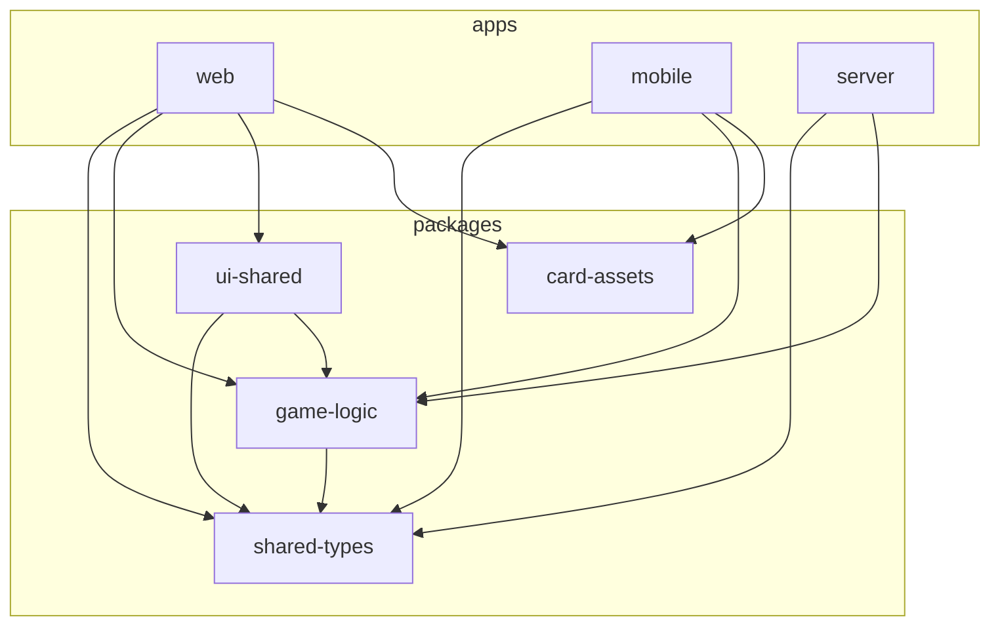

# 5. Building Block View

## 5.1 Level 1: Whitebox Overall System



### Package Overview

| Package              | Purpose                                        |
| -------------------- | ---------------------------------------------- |
| `@dabb/shared-types` | TypeScript types shared across all apps        |
| `@dabb/game-logic`   | Core game rules, state reducer, meld detection |
| `@dabb/ui-shared`    | React hooks for socket and state management    |
| `@dabb/card-assets`  | SVG card graphics and utilities                |
| `@dabb/web`          | React web application                          |
| `@dabb/mobile`       | React Native mobile application                |
| `@dabb/server`       | Express + Socket.IO backend                    |

## 5.2 Level 2: Packages

### @dabb/shared-types

```
src/
├── cards.ts       # Card, Suit, Rank types
├── game.ts        # GameState, Meld types
├── events.ts      # GameEvent union type
├── api.ts         # REST API types
└── socket.ts      # Socket.IO event types
```

### @dabb/game-logic

```
src/
├── cards/
│   └── deck.ts       # Deck creation, shuffling, dealing
├── melds/
│   └── detector.ts   # Meld detection algorithm
├── phases/
│   ├── bidding.ts    # Bidding rules
│   └── tricks.ts     # Trick-taking rules
└── state/
    ├── reducer.ts    # Event sourcing reducer
    └── views.ts      # Player view filtering
```

### @dabb/ui-shared

```
src/
├── useSocket.ts           # Socket.IO connection hook
├── useGameState.ts        # Event-sourced state management
├── useRoundHistory.ts     # Round history computation for scoreboard
└── useLocalStorage.ts     # Session credential persistence
```

### @dabb/server

```
src/
├── routes/
│   └── sessions.ts   # REST API routes
├── services/
│   ├── sessionService.ts   # Session/player management
│   ├── eventService.ts     # Event persistence
│   └── gameService.ts      # Game action handlers
├── socket/
│   └── handlers.ts   # Socket.IO event handlers
└── index.ts          # Server entry point
```

## 5.3 Level 3: Game Logic

### State Reducer

The game state is managed through an event-sourcing reducer:

```typescript
function gameReducer(state: GameState, event: GameEvent, playerIndex: PlayerIndex): GameState {
  switch (event.type) {
    case 'GAME_STARTED':
    // Initialize game state
    case 'CARDS_DEALT':
    // Distribute cards to players
    case 'BID_PLACED':
    // Update current bid
    // ... etc
  }
}
```

### Event Types

| Event           | Phase    | Description             |
| --------------- | -------- | ----------------------- |
| GAME_STARTED    | dealing  | Game initialized        |
| CARDS_DEALT     | dealing  | Cards distributed       |
| BID_PLACED      | bidding  | Player placed bid       |
| BID_PASSED      | bidding  | Player passed           |
| BIDDING_WON     | bidding  | Winner determined       |
| DABB_TAKEN      | dabb     | Winner took dabb        |
| CARDS_DISCARDED | dabb     | Cards discarded         |
| TRUMP_DECLARED  | trump    | Trump suit set          |
| MELDS_DECLARED  | melding  | Melds announced         |
| CARD_PLAYED     | tricks   | Card played to trick    |
| TRICK_WON       | tricks   | Trick completed         |
| ROUND_ENDED     | scoring  | Round scores calculated |
| GAME_ENDED      | finished | Final winner            |
