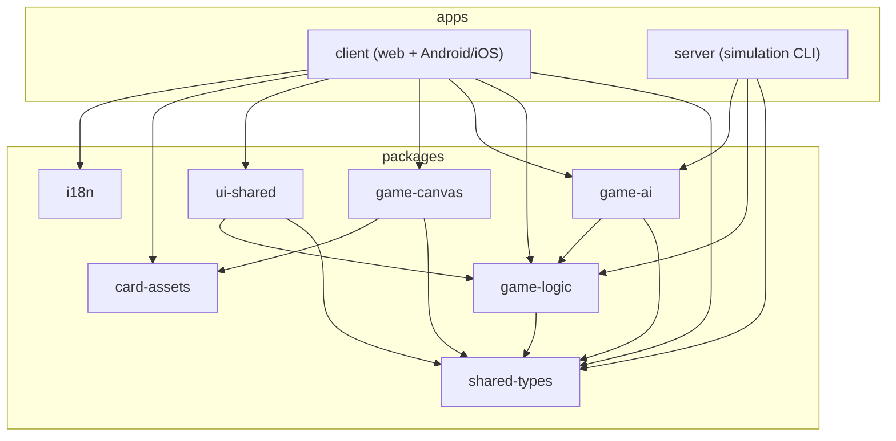

# 5. Building Block View

## 5.1 Level 1: Whitebox Overall System


```mermaid
flowchart TB
    subgraph apps
        client["client (web + Android/iOS)"]
        server
    end

    subgraph packages
        types[shared-types]
        logic[game-logic]
        gameai[game-ai]
        canvas[game-canvas]
        ui[ui-shared]
        assets[card-assets]
        i18n[i18n]
    end

    client --> types
    client --> logic
    client --> gameai
    client --> canvas
    client --> ui
    client --> assets
    client --> i18n

    server["server (simulation CLI)"] --> types
    server --> logic
    server --> gameai

    canvas --> types
    canvas --> assets

    ui --> types
    ui --> logic

    gameai --> types
    gameai --> logic

    logic --> types
```

### Package Overview

| Package              | Purpose                                                  |
| -------------------- | -------------------------------------------------------- |
| `@dabb/shared-types` | TypeScript types shared across all apps                  |
| `@dabb/game-logic`   | Core game rules, state reducer, meld detection           |
| `@dabb/game-ai`      | AI player logic, offline game engine (OfflineGameEngine) |
| `@dabb/ui-shared`    | React hooks for game state, round history, and log       |
| `@dabb/card-assets`  | SVG card graphics and utilities                          |
| `@dabb/i18n`         | Internationalization (German, English)                   |
| `@dabb/client`       | React Native + Expo client (Android/iOS/web)             |
| `@dabb/game-canvas`  | Skia-based game canvas rendering                         |
| `@dabb/server`       | AI simulation CLI (`pnpm simulate`)                      |

## 5.2 Level 2: Packages

### @dabb/shared-types

```
src/
├── cards.ts       # Card, Suit, Rank types
├── game.ts        # GameState, Meld types
├── events.ts      # GameEvent union type
├── errors.ts      # Error codes and GameError
├── gameLog.ts     # Game log entry types
└── ai.ts          # AI action and context types
```

### @dabb/game-logic

```
src/
├── cards/
│   └── deck.ts       # Deck creation, shuffling, dealing
├── events/
│   └── generators.ts # Event factory functions
├── export/
│   └── eventFormatter.ts  # Human-readable event log formatting
├── melds/
│   └── detector.ts   # Meld detection algorithm
├── phases/
│   ├── bidding.ts    # Bidding rules
│   └── tricks.ts     # Trick-taking rules
└── state/
    ├── reducer.ts    # Event sourcing reducer
    └── views.ts      # Player view filtering (anti-cheat)
```

### @dabb/game-ai

```
src/
├── AIPlayer.ts             # AI player interface, factory, and AIDifficulty type
├── BinokelAIPlayer.ts      # AI decision logic (easy/medium/hard difficulty)
├── OfflineGameEngine.ts    # Offline single-player engine (human + AI, no server)
└── index.ts                # Public exports
```

Used by the server (AI simulation CLI) and the client (offline mode).

### @dabb/ui-shared

```
src/
├── useGameState.ts             # Event-sourced state management
├── useRoundHistory.ts          # Round history computation for scoreboard
├── useGameLog.ts               # Game log entries hook
├── useActionRequired.ts        # Your-turn detection hook
├── useCelebration.ts           # Win celebration effects hook
└── useTrickAnimationState.ts   # Trick animation phase state machine
```

Session credential persistence lives in the client app: `apps/client/src/hooks/useStorage.ts`.

### @dabb/server (simulation CLI only)

```
src/
├── ai/
│   └── index.ts                  # Re-exports from @dabb/game-ai
└── simulation/
    ├── SimulationEngine.ts       # In-memory AI game engine
    └── runner.ts                 # CLI entry point (`pnpm simulate`)
```

The server package exists solely to provide the AI simulation CLI. It has no database, HTTP server, or Socket.IO dependencies.

| Component          | Responsibility                                                          |
| ------------------ | ----------------------------------------------------------------------- |
| `SimulationEngine` | Runs a single game: manages events, state, AI instances, and scoring    |
| `runner.ts`        | CLI entry point: arg parsing, concurrency batching, output, and summary |

## 5.3 Level 3: Game Logic

### State Reducer

The game state is managed through an event-sourcing reducer:

```typescript
function gameReducer(state: GameState, event: GameEvent, playerIndex: PlayerIndex): GameState {
  switch (event.type) {
    case 'GAME_STARTED':
    // Initialize game state
    case 'CARDS_DEALT':
    // Distribute cards to players
    case 'BID_PLACED':
    // Update current bid
    // ... etc
  }
}
```

### Event Types

| Event              | Phase    | Description             |
| ------------------ | -------- | ----------------------- |
| GAME_STARTED       | dealing  | Game initialized        |
| CARDS_DEALT        | dealing  | Cards distributed       |
| NEW_ROUND_STARTED  | dealing  | New round begins        |
| BID_PLACED         | bidding  | Player placed bid       |
| PLAYER_PASSED      | bidding  | Player passed           |
| BIDDING_WON        | bidding  | Winner determined       |
| DABB_TAKEN         | dabb     | Winner took dabb        |
| CARDS_DISCARDED    | dabb     | Cards discarded         |
| GOING_OUT          | dabb     | Bid winner forfeits     |
| TRUMP_DECLARED     | trump    | Trump suit set          |
| MELDS_DECLARED     | melding  | Melds announced         |
| MELDING_COMPLETE   | melding  | All melds declared      |
| CARD_PLAYED        | tricks   | Card played to trick    |
| TRICK_WON          | tricks   | Trick completed         |
| ROUND_SCORED       | scoring  | Round scores calculated |
| GAME_FINISHED      | finished | Final winner            |
| GAME_TERMINATED    | —        | Game terminated by exit |
| PLAYER_JOINED      | —        | Player joined session   |
| PLAYER_LEFT        | —        | Player disconnected     |
| PLAYER_RECONNECTED | —        | Player reconnected      |
