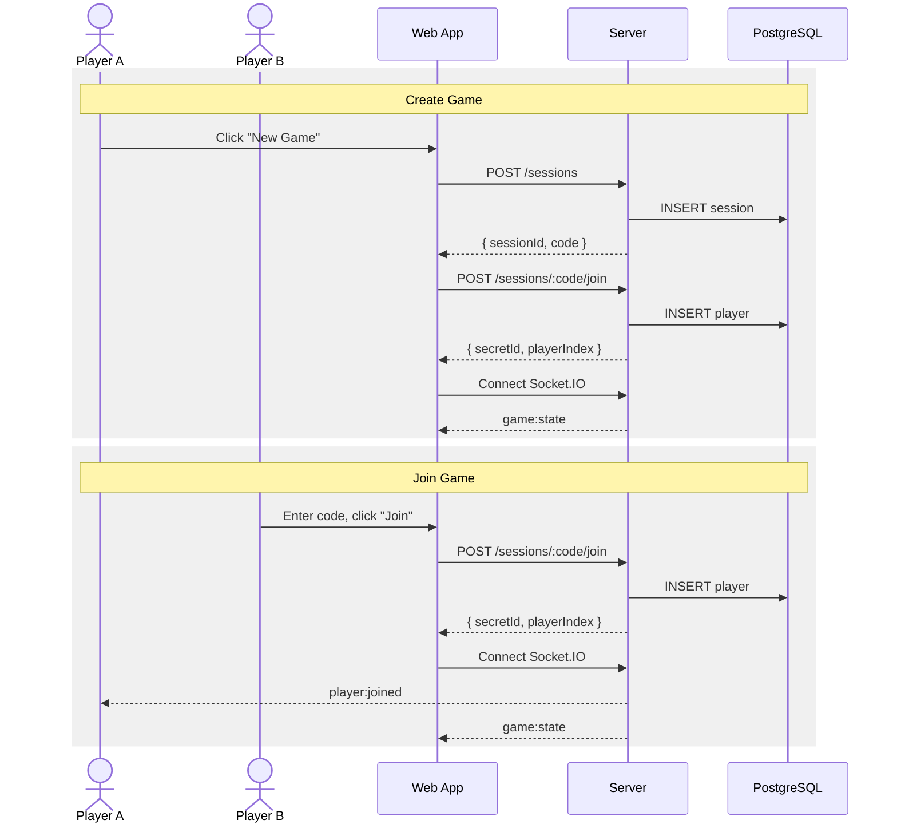
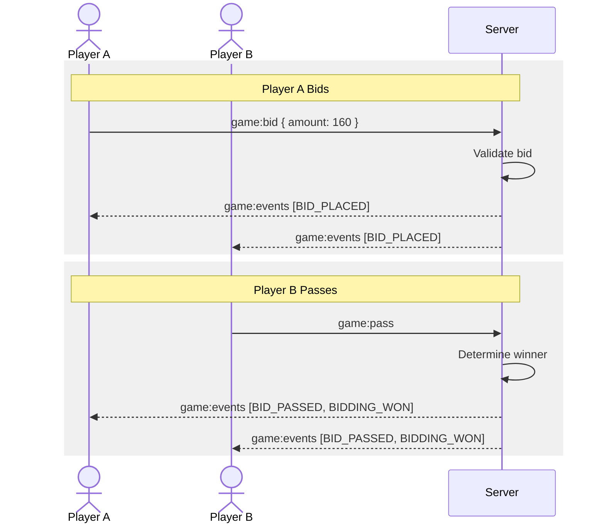
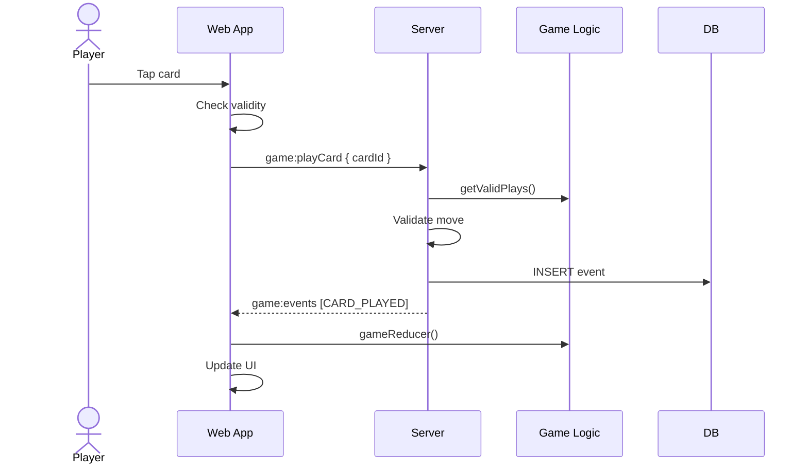
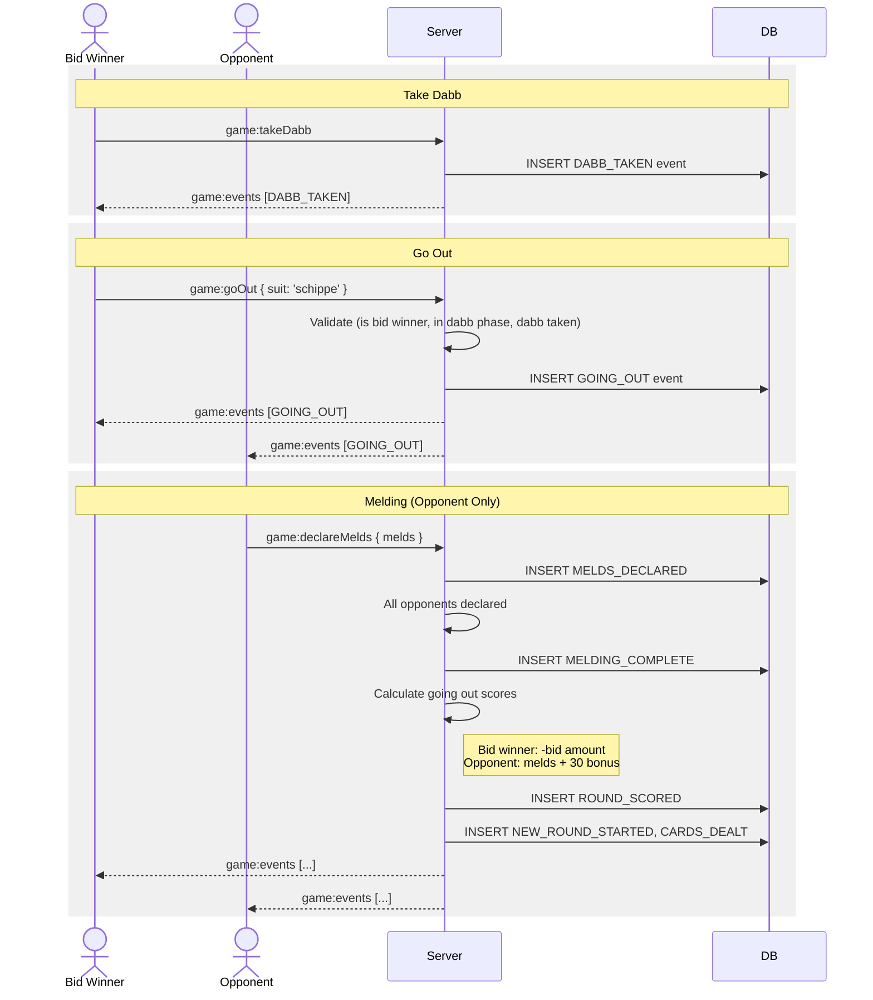
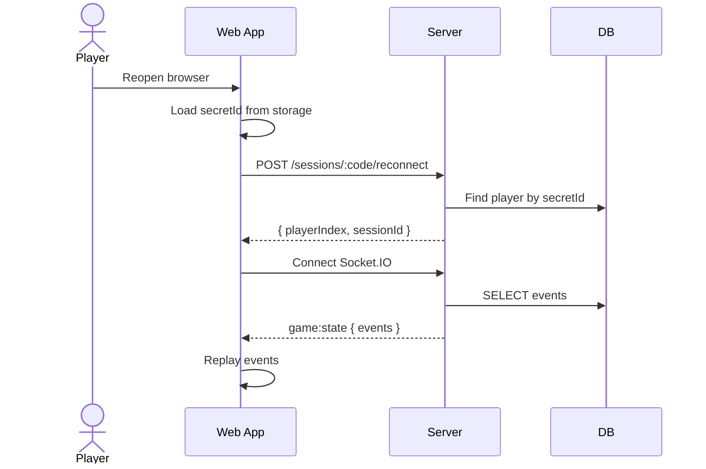

# 6. Runtime View

## 6.1 Create and Join Game

## 6.2 Bidding Phase

## 6.3 Playing a Card

## 6.4 Going Out (Forfeit Round)

When the bid winner doesn't think they can make their bid after seeing the Dabb, they can choose to "go out".

**Key Points:**

- Bid winner can only go out after taking the dabb
- Going out skips the trump declaration, tricks phase entirely
- Bid winner cannot declare melds when going out
- Opponents each get their melds + 30 bonus points
- Bid winner loses their bid amount

## 6.5 Reconnection

