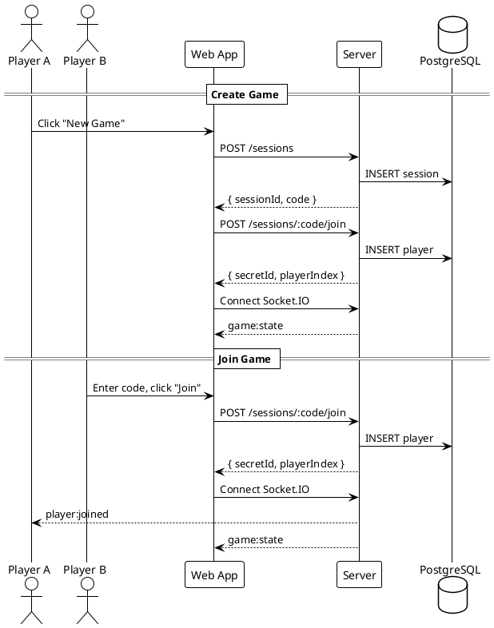
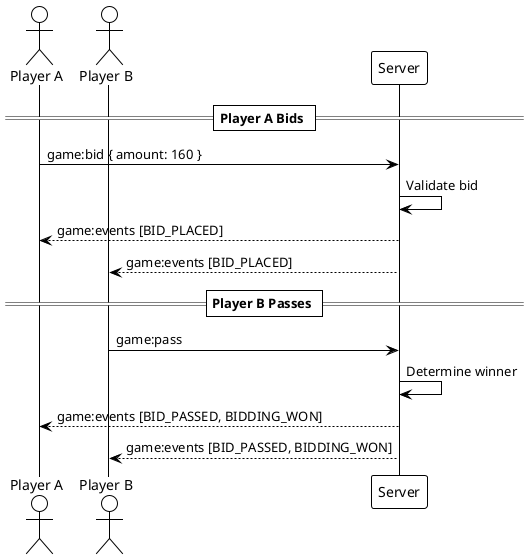
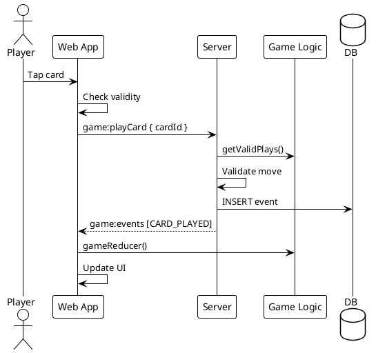
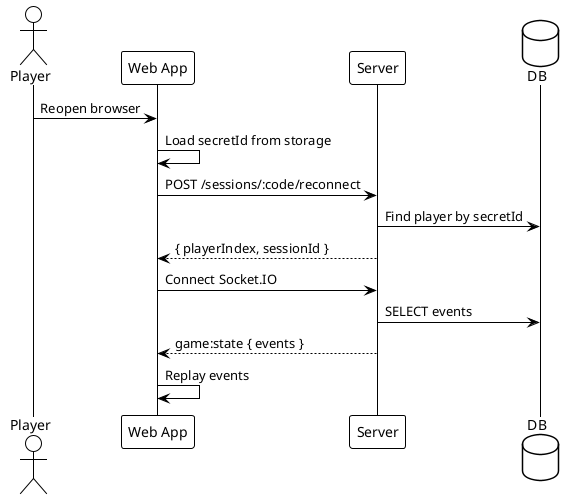

# 6. Runtime View

## 6.1 Create and Join Game

```plantuml
@startuml
!theme plain

actor "Player A" as playerA
actor "Player B" as playerB
participant "Web App" as web
participant "Server" as server
database "PostgreSQL" as db

== Create Game ==
playerA -> web : Click "New Game"
web -> server : POST /sessions
server -> db : INSERT session
server --> web : { sessionId, code }
web -> server : POST /sessions/:code/join
server -> db : INSERT player
server --> web : { secretId, playerIndex }
web -> server : Connect Socket.IO
server --> web : game:state

== Join Game ==
playerB -> web : Enter code, click "Join"
web -> server : POST /sessions/:code/join
server -> db : INSERT player
server --> web : { secretId, playerIndex }
web -> server : Connect Socket.IO
server --> playerA : player:joined
server --> web : game:state

@enduml
```

## 6.2 Bidding Phase

```plantuml
@startuml
!theme plain

actor "Player A" as playerA
actor "Player B" as playerB
participant "Server" as server

== Player A Bids ==
playerA -> server : game:bid { amount: 160 }
server -> server : Validate bid
server --> playerA : game:events [BID_PLACED]
server --> playerB : game:events [BID_PLACED]

== Player B Passes ==
playerB -> server : game:pass
server -> server : Determine winner
server --> playerA : game:events [BID_PASSED, BIDDING_WON]
server --> playerB : game:events [BID_PASSED, BIDDING_WON]

@enduml
```

## 6.3 Playing a Card

```plantuml
@startuml
!theme plain

actor "Player" as player
participant "Web App" as web
participant "Server" as server
participant "Game Logic" as logic
database "DB" as db

player -> web : Tap card
web -> web : Check validity
web -> server : game:playCard { cardId }
server -> logic : getValidPlays()
server -> server : Validate move
server -> db : INSERT event
server --> web : game:events [CARD_PLAYED]
web -> logic : gameReducer()
web -> web : Update UI

@enduml
```

## 6.4 Reconnection

```plantuml
@startuml
!theme plain

actor "Player" as player
participant "Web App" as web
participant "Server" as server
database "DB" as db

player -> web : Reopen browser
web -> web : Load secretId from storage
web -> server : POST /sessions/:code/reconnect
server -> db : Find player by secretId
server --> web : { playerIndex, sessionId }
web -> server : Connect Socket.IO
server -> db : SELECT events
server --> web : game:state { events }
web -> web : Replay events

@enduml
```
