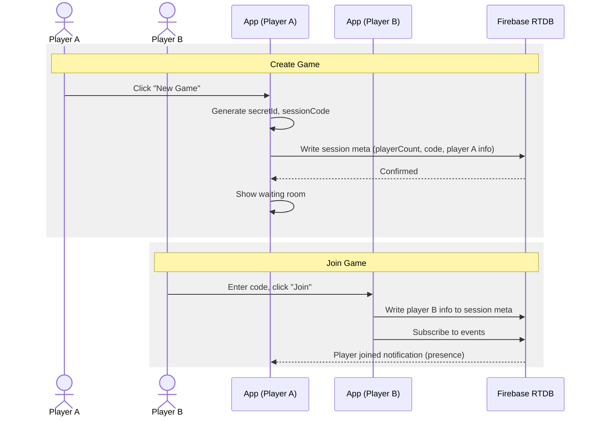
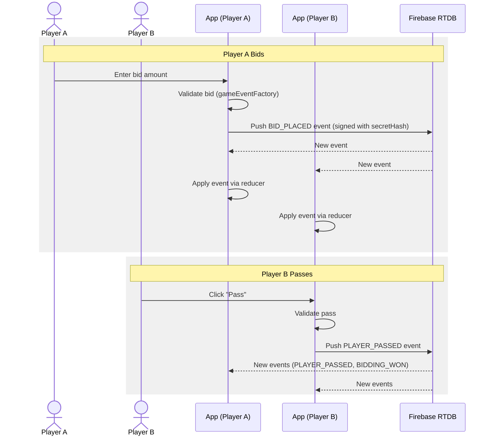
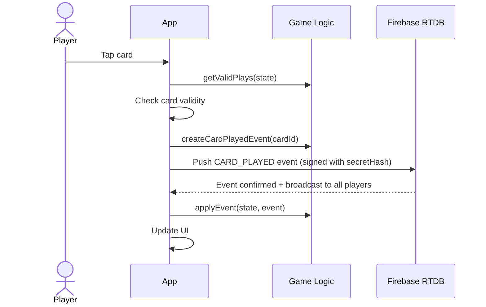
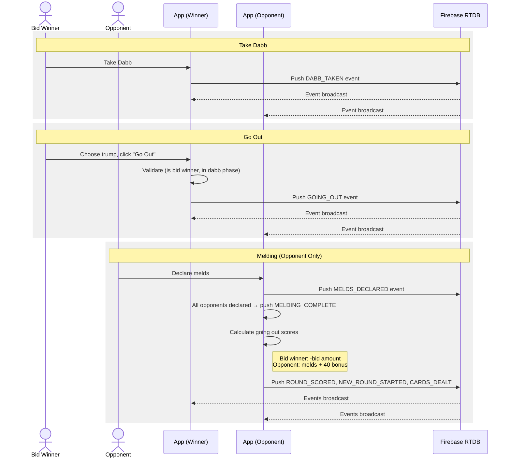
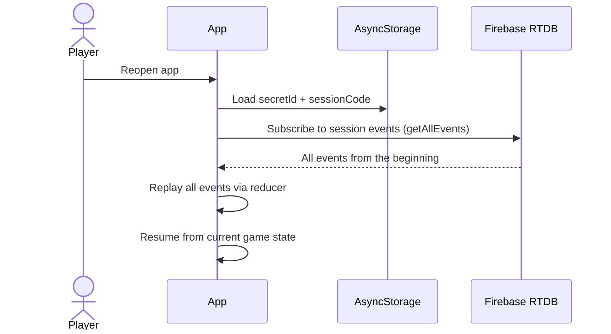
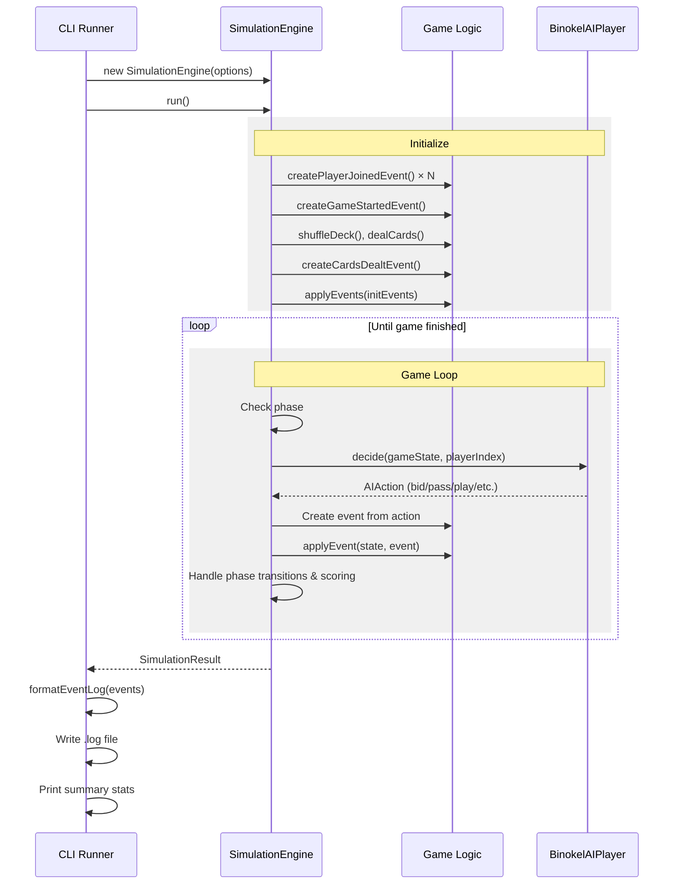

# 6. Runtime View

## 6.1 Create and Join Game

```mermaid
sequenceDiagram
    actor playerA as Player A
    actor playerB as Player B
    participant appA as App (Player A)
    participant appB as App (Player B)
    participant firebase as Firebase RTDB

    rect rgb(240, 240, 240)
        Note over playerA, firebase: Create Game
        playerA->>appA: Click "New Game"
        appA->>appA: Generate secretId, sessionCode
        appA->>firebase: Write session meta (playerCount, code, player A info)
        firebase-->>appA: Confirmed
        appA->>appA: Show waiting room
    end

    rect rgb(240, 240, 240)
        Note over playerB, firebase: Join Game
        playerB->>appB: Enter code, click "Join"
        appB->>firebase: Write player B info to session meta
        appB->>firebase: Subscribe to events
        firebase-->>appA: Player joined notification (presence)
    end
```

## 6.2 Bidding Phase

```mermaid
sequenceDiagram
    actor playerA as Player A
    actor playerB as Player B
    participant appA as App (Player A)
    participant appB as App (Player B)
    participant firebase as Firebase RTDB

    rect rgb(240, 240, 240)
        Note over playerA, firebase: Player A Bids
        playerA->>appA: Enter bid amount
        appA->>appA: Validate bid (gameEventFactory)
        appA->>firebase: Push BID_PLACED event (signed with secretHash)
        firebase-->>appA: New event
        firebase-->>appB: New event
        appA->>appA: Apply event via reducer
        appB->>appB: Apply event via reducer
    end

    rect rgb(240, 240, 240)
        Note over playerB, firebase: Player B Passes
        playerB->>appB: Click "Pass"
        appB->>appB: Validate pass
        appB->>firebase: Push PLAYER_PASSED event
        firebase-->>appA: New events (PLAYER_PASSED, BIDDING_WON)
        firebase-->>appB: New events
    end
```

## 6.3 Playing a Card

```mermaid
sequenceDiagram
    actor player as Player
    participant app as App
    participant logic as Game Logic
    participant firebase as Firebase RTDB

    player->>app: Tap card
    app->>logic: getValidPlays(state)
    app->>app: Check card validity
    app->>logic: createCardPlayedEvent(cardId)
    app->>firebase: Push CARD_PLAYED event (signed with secretHash)
    firebase-->>app: Event confirmed + broadcast to all players
    app->>logic: applyEvent(state, event)
    app->>app: Update UI
```

**Event signing:** Each event push includes `authorHash` (SHA-256 of the player's `secretId`). Firebase security rules verify that only registered players can push events.

## 6.4 Going Out (Forfeit Round)

When the bid winner doesn't think they can make their bid after seeing the Dabb, they can choose to "go out".

```mermaid
sequenceDiagram
    actor winner as Bid Winner
    actor opponent as Opponent
    participant appW as App (Winner)
    participant appO as App (Opponent)
    participant firebase as Firebase RTDB

    rect rgb(240, 240, 240)
        Note over winner, firebase: Take Dabb
        winner->>appW: Take Dabb
        appW->>firebase: Push DABB_TAKEN event
        firebase-->>appW: Event broadcast
        firebase-->>appO: Event broadcast
    end

    rect rgb(240, 240, 240)
        Note over winner, firebase: Go Out
        winner->>appW: Choose trump, click "Go Out"
        appW->>appW: Validate (is bid winner, in dabb phase)
        appW->>firebase: Push GOING_OUT event
        firebase-->>appW: Event broadcast
        firebase-->>appO: Event broadcast
    end

    rect rgb(240, 240, 240)
        Note over opponent, firebase: Melding (Opponent Only)
        opponent->>appO: Declare melds
        appO->>firebase: Push MELDS_DECLARED event
        appO->>appO: All opponents declared → push MELDING_COMPLETE
        appO->>appO: Calculate going out scores
        Note right of appO: Bid winner: -bid amount<br/>Opponent: melds + 40 bonus
        appO->>firebase: Push ROUND_SCORED, NEW_ROUND_STARTED, CARDS_DEALT
        firebase-->>appW: Events broadcast
        firebase-->>appO: Events broadcast
    end
```

**Key Points:**

- Bid winner can only go out after taking the dabb
- Going out skips trump declaration and tricks phase entirely
- Bid winner cannot declare melds when going out
- Opponents each get their melds + 40 bonus points
- Bid winner loses their bid amount

## 6.5 Reconnection

```mermaid
sequenceDiagram
    actor player as Player
    participant app as App
    participant storage as AsyncStorage
    participant firebase as Firebase RTDB

    player->>app: Reopen app
    app->>storage: Load secretId + sessionCode
    app->>firebase: Subscribe to session events (getAllEvents)
    firebase-->>app: All events from the beginning
    app->>app: Replay all events via reducer
    app->>app: Resume from current game state
```

No server round-trip needed — full game state is reconstructed by replaying all events from Firebase RTDB.

## 6.6 AI Simulation (Offline)

The simulation engine runs complete AI-vs-AI games in-memory, bypassing all network infrastructure. Used for testing AI strategy and detecting game logic edge cases.

```mermaid
sequenceDiagram
    participant runner as CLI Runner
    participant engine as SimulationEngine
    participant logic as Game Logic
    participant ai as BinokelAIPlayer

    runner->>engine: new SimulationEngine(options)
    runner->>engine: run()

    rect rgb(240, 240, 240)
        Note over engine, ai: Initialize
        engine->>logic: createPlayerJoinedEvent() × N
        engine->>logic: createGameStartedEvent()
        engine->>logic: shuffleDeck(), dealCards()
        engine->>logic: createCardsDealtEvent()
        engine->>logic: applyEvents(initEvents)
    end

    loop Until game finished
        rect rgb(240, 240, 240)
            Note over engine, ai: Game Loop
            engine->>engine: Check phase
            engine->>ai: decide(gameState, playerIndex)
            ai-->>engine: AIAction (bid/pass/play/etc.)
            engine->>logic: Create event from action
            engine->>logic: applyEvent(state, event)
            engine->>engine: Handle phase transitions & scoring
        end
    end

    engine-->>runner: SimulationResult
    runner->>runner: formatEventLog(events)
    runner->>runner: Write .log file
    runner->>runner: Print summary stats
```

**Key differences from live P2P flow:**

| Aspect          | Live P2P                             | Simulation                        |
| --------------- | ------------------------------------ | --------------------------------- |
| State storage   | Firebase RTDB (all events persisted) | In-memory only                    |
| AI timing       | 500–4000ms delays for natural feel   | Instant (no delays)               |
| Concurrency     | Firebase subscription callbacks      | `Promise.allSettled` batches      |
| Event signing   | secretHash required for writes       | No auth (all-knowing)             |
| Error handling  | Error shown to player in UI          | Partial result with error log     |
| Stuck detection | None (connection loss shows banner)  | Action limit + wall-clock timeout |
