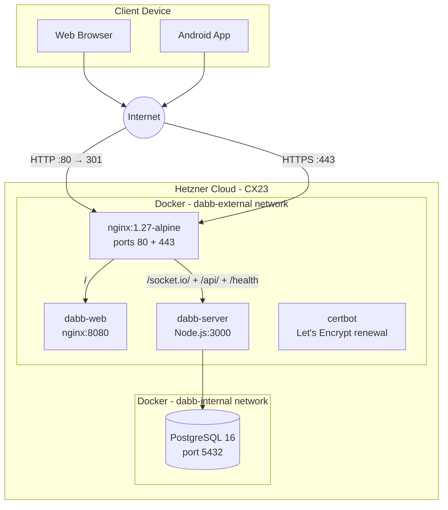

# 7. Deployment View

## 7.1 Infrastructure Overview



**Live URL:** `https://dabb.degler.info`

## 7.2 Hosting

| Property       | Value                              |
| -------------- | ---------------------------------- |
| Provider       | Hetzner Cloud                      |
| Server type    | CX23 (2 vCPU, 4 GB RAM, 40 GB SSD) |
| Location       | Nuremberg, Germany (nbg1)          |
| OS             | Ubuntu 24.04 LTS                   |
| Cost           | ~€3.49/month                       |
| Provisioned by | OpenTofu (`tofu/`)                 |

## 7.3 Network Architecture

nginx is the **only** container with external port bindings (80 and 443). All other containers communicate via internal Docker networks:

| Network         | Members            | Purpose                   |
| --------------- | ------------------ | ------------------------- |
| `dabb-external` | nginx, web, server | nginx → app routing       |
| `dabb-internal` | server, postgres   | DB access (never exposed) |

### nginx Routing

| Path                           | Upstream       | Notes                           |
| ------------------------------ | -------------- | ------------------------------- |
| `/.well-known/acme-challenge/` | certbot volume | Let's Encrypt ACME              |
| `/socket.io/`                  | `server:3000`  | WebSocket with `Upgrade` header |
| `/api/`                        | `server:3000`  | REST API                        |
| `/health`                      | `server:3000`  | Health check endpoint           |
| `/`                            | `web:8080`     | Static React SPA                |

HTTP requests (port 80) are redirected to HTTPS with a 301.

## 7.4 Container Architecture

### nginx (`dabb-nginx`)

- Image: `nginx:alpine` (latest)
- Terminates TLS, routes to web and server
- Config mounted from `deploy/nginx/nginx.conf`
- Certbot volumes mounted read-only for TLS certificates

### Web Container (`dabb-web`)

```dockerfile
FROM node:22-alpine AS builder    # Build React app
FROM nginx:1.27-alpine            # Serve static files on :8080
```

- Pinned to `nginx:1.27-alpine` for predictable updates
- Serves the pre-built React SPA
- Healthcheck uses `127.0.0.1:8080` (not `localhost` — nginx only binds IPv4)

### Server Container (`dabb-server`)

```dockerfile
FROM node:22-alpine
# Multi-stage build, non-root user
# Health check: GET /health
EXPOSE 3000
```

### Database (`dabb-postgres`)

- PostgreSQL 16 Alpine
- Persistent volume (`postgres_data`)
- Internal network only — never exposed externally
- Healthcheck: `pg_isready`

### Certbot (`dabb-certbot`)

- Runs `certbot renew` in a loop (every 12 hours)
- Let's Encrypt certificates renewed automatically when <30 days to expiry
- Stores certs in `deploy/nginx/certbot/conf/` (bind-mounted volume)

## 7.5 Environment Variables

| Variable            | Required | Description                   | Value                          |
| ------------------- | -------- | ----------------------------- | ------------------------------ |
| `POSTGRES_PASSWORD` | Yes      | Database password             | Strong random hex string       |
| `CLIENT_URL`        | Yes      | Web app URL for CORS          | `https://dabb.degler.info`     |
| `VITE_SERVER_URL`   | Yes      | Server URL for frontend       | `https://dabb.degler.info`     |
| `DATABASE_URL`      | No       | Override DB connection string | Auto-constructed from password |
| `PORT`              | No       | Server port (default: 3000)   | `3000`                         |
| `NODE_ENV`          | No       | Environment                   | `production`                   |

> **Important:** `POSTGRES_PASSWORD` must be URL-safe (no `#`, `@`, `:`, `/`). Use `openssl rand -hex 32` to generate it — hex encoding is safe in PostgreSQL connection URLs.

## 7.6 CI/CD Pipeline

```
┌─────────────┐   ┌──────────┐   ┌────────────────┐   ┌─────────────┐   ┌─────────────┐
│  Push/PR    │ → │  Build   │ → │ Security Scan  │ → │ Push Image  │ → │   Deploy    │
│  to main    │   │  & Test  │   │ (Trivy + Audit)│   │ to GHCR     │   │  to Hetzner │
└─────────────┘   └──────────┘   └────────────────┘   └─────────────┘   └─────────────┘
                                                                          (main only,
                                                                           after CI pass)
```

- **CI** (`.github/workflows/ci.yml`): build, test, security scan, push Docker images to `ghcr.io`
- **Deploy** (`.github/workflows/deploy.yml`): triggers via `workflow_run` after CI succeeds on `main`; SSHes into server as `dabb` user and runs `docker compose pull && up -d`

Security scanning includes:

- OSV Scanner for dependency vulnerabilities
- Trivy for container image CVEs
- Results uploaded to GitHub Security tab

## 7.7 SSL/TLS

- Provider: Let's Encrypt (via certbot)
- Certificate covers: `dabb.degler.info`
- Initial issuance: manual one-time script (`deploy/nginx/init-letsencrypt.sh`)
- Renewal: fully automatic via the certbot container (runs every 12h, renews when <30 days remaining)
- Current expiry: 2026-05-22 (auto-renews before then)

## 7.8 Health Checks

| Service    | Method       | Endpoint                 | Interval | Timeout |
| ---------- | ------------ | ------------------------ | -------- | ------- |
| Server     | HTTP GET     | `/health`                | 30s      | 3s      |
| Web        | HTTP GET     | `http://127.0.0.1:8080/` | 30s      | 3s      |
| PostgreSQL | `pg_isready` | —                        | 10s      | 5s      |

## 7.9 OS Maintenance

`unattended-upgrades` is installed and configured via cloud-init. Security patches are applied automatically daily with no manual intervention required.

## 7.10 Deployment Commands

### Local Development

```bash
docker compose up -d
# Web: http://localhost:8080
# Server: http://localhost:3000
```

### Production (manual)

```bash
ssh -i ~/.ssh/dabb-deploy dabb@46.224.213.237
cd /opt/dabb
docker compose -f docker-compose.prod.yml pull server web
docker compose -f docker-compose.prod.yml up -d
docker image prune -f
```

### Re-provisioning the server

```bash
cd tofu/
tofu apply \
  -var="hetzner_api_token=<TOKEN>" \
  -var="ssh_public_key=$(cat ~/.ssh/dabb-deploy.pub)"
```

See `DEPLOYMENT.md` for the full one-time setup sequence.

## 7.11 Monitoring

- **Uptime:** UptimeRobot monitors `https://dabb.degler.info/health` every 5 minutes with email alerts
- **Logs:** `docker compose -f docker-compose.prod.yml logs -f <service>`
- **Container health:** `docker compose -f docker-compose.prod.yml ps`

## 7.12 Backup Strategy

### Database Backups

```bash
# Manual backup
docker exec dabb-postgres pg_dump -U dabb dabb > backup-$(date +%Y%m%d).sql

# Restore
docker exec -i dabb-postgres psql -U dabb dabb < backup.sql
```

Recommended: set up a cron job on the server for automated daily backups.

## 7.13 Scaling Considerations

For current low-traffic usage, a single CX23 instance is more than sufficient. If traffic grows:

- **More resources**: Upgrade to CX33 (4 vCPU, 8GB) or CX43 via Hetzner console
- **Managed DB**: Migrate PostgreSQL to Hetzner Managed Databases to remove backup burden
- **Load balancing**: Add Hetzner Load Balancer + multiple CX23s
- **Edge deployment**: Fly.io for multi-region WebSocket distribution
