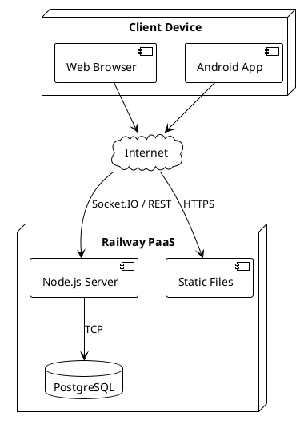

# 7. Deployment View

## 7.1 Infrastructure



## 7.2 Deployment Options

### Railway (Recommended)

```yaml
# railway.toml
[build]
  builder = "nixpacks"

[deploy]
  startCommand = "node dist/index.js"
  healthcheckPath = "/health"
```

### Docker

```dockerfile
FROM node:20-alpine
WORKDIR /app
COPY package*.json ./
RUN npm ci --production
COPY dist ./dist
EXPOSE 3000
CMD ["node", "dist/index.js"]
```

## 7.3 Environment Variables

| Variable | Description | Example |
|----------|-------------|---------|
| DATABASE_URL | PostgreSQL connection | `postgresql://...` |
| PORT | Server port | `3000` |
| CLIENT_URL | CORS origin | `https://dabb.app` |
| NODE_ENV | Environment | `production` |
