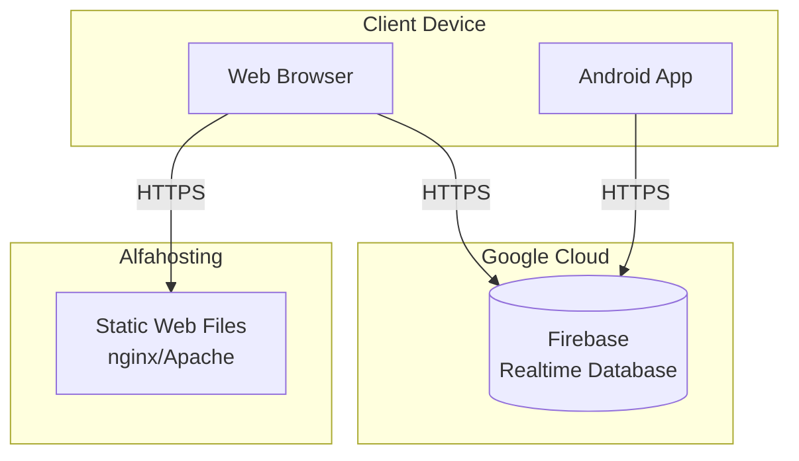

# 7. Deployment View

## 7.1 Infrastructure Overview


```mermaid
flowchart TB
    subgraph client [Client Device]
        browser[Web Browser]
        android[Android App]
    end

    subgraph google [Google Cloud]
        firebase[(Firebase\nRealtime Database)]
    end

    subgraph alfahosting [Alfahosting]
        web[Static Web Files\nnginx/Apache]
    end

    browser -->|"HTTPS"| web
    android -->|"HTTPS"| firebase
    browser -->|"HTTPS"| firebase
```

**Live URL:** `https://dabb.degler.info`

## 7.2 Hosting

| Component   | Provider           | Details                               |
| ----------- | ------------------ | ------------------------------------- |
| Web app     | Alfahosting (SFTP) | Static files, shared hosting, Apache  |
| Android app | Google Play Store  | Published via CI                      |
| Backend     | Firebase RTDB      | Google-managed, `europe-west1` region |

No self-hosted server infrastructure. The game backend is Firebase Realtime Database only.

## 7.3 Architecture

The app is **serverless P2P**. All game state lives in Firebase RTDB as an append-only event log. Clients read and write events directly; no application server intermediary.

| Concern         | How handled                                                    |
| --------------- | -------------------------------------------------------------- |
| Game state      | Firebase RTDB — append-only event log per session              |
| Auth / identity | `secretId` stored in AsyncStorage; SHA-256 hash stored in RTDB |
| Write access    | Firebase security rules — only registered players can push     |
| Reconnection    | Replay all events from RTDB on reconnect                       |
| Session cleanup | Firebase TTL rules / manual cleanup                            |

## 7.4 Firebase Security Rules

Write access is gated by `secretHash` — only players who registered for a session can push events:

```json
{
  "rules": {
    "sessions": {
      "$code": {
        ".read": "auth == null",
        "events": {
          "$eventId": {
            ".write": "root.child('sessions/' + $code + '/meta/players').forEach(function(p) {
              return p.child('secretHash').val() === newData.child('authorHash').val()
            })"
          }
        }
      }
    }
  }
}
```

See `docs/FIREBASE_SETUP.md` → Section 4 for the full rules.

> **Note:** Event data in Firebase is readable by all session participants. Client-side filtering (`filterEventForPlayer` in `useGameState.ts`) hides opponents' cards in the UI, but raw events are readable from RTDB. This is an accepted trade-off for the serverless architecture.

## 7.5 CI/CD Pipeline

```
┌─────────────┐   ┌──────────┐   ┌────────────────┐   ┌──────────────────┐
│  Push/PR    │ → │  Build   │ → │ Security Scan  │ → │  Deploy Web      │
│  to main    │   │  & Test  │   │ (OSV Scanner)  │   │  (SFTP → Alpha.) │
└─────────────┘   └──────────┘   └────────────────┘   └──────────────────┘
```

- **CI** (`.github/workflows/ci.yml`): build all packages, lint, typecheck, test, bundle web client (catches Metro resolution errors), build Android APK artifact
- **Deploy Web** (`.github/workflows/deploy-web.yml`): triggers after CI succeeds on `main`; builds web bundle with Firebase env vars baked in, deploys via FTPS to Alfahosting
- **Publish Android** (`.github/workflows/publish-android.yml`): builds signed AAB and uploads to Google Play

Firebase env vars are stored as GitHub Actions repository variables (`EXPO_PUBLIC_FIREBASE_*`) and baked into the web bundle at build time.

## 7.6 Environment Variables (CI)

| Variable                                   | Where set            | Purpose                    |
| ------------------------------------------ | -------------------- | -------------------------- |
| `EXPO_PUBLIC_FIREBASE_API_KEY`             | GitHub repo variable | Firebase config            |
| `EXPO_PUBLIC_FIREBASE_AUTH_DOMAIN`         | GitHub repo variable | Firebase config            |
| `EXPO_PUBLIC_FIREBASE_DATABASE_URL`        | GitHub repo variable | Firebase RTDB URL          |
| `EXPO_PUBLIC_FIREBASE_PROJECT_ID`          | GitHub repo variable | Firebase config            |
| `EXPO_PUBLIC_FIREBASE_STORAGE_BUCKET`      | GitHub repo variable | Firebase config            |
| `EXPO_PUBLIC_FIREBASE_MESSAGING_SENDER_ID` | GitHub repo variable | Firebase config            |
| `EXPO_PUBLIC_FIREBASE_APP_ID`              | GitHub repo variable | Firebase config            |
| `SFTP_HOST`                                | GitHub secret        | Alfahosting SFTP server    |
| `SFTP_USER`                                | GitHub secret        | SFTP username              |
| `SFTP_PASSWORD`                            | GitHub secret        | SFTP password              |
| `SFTP_TARGET_DIR`                          | GitHub secret        | Target directory on server |

## 7.7 Local Development

For local development, create `apps/client/.env.local` with Firebase config values (copy from `deploy/.env.example`):

```bash
EXPO_PUBLIC_FIREBASE_API_KEY=...
EXPO_PUBLIC_FIREBASE_DATABASE_URL=...
# etc.
```

Then start the client:

```bash
pnpm --filter @dabb/client start
```

No local server needed — the app connects directly to Firebase RTDB.
