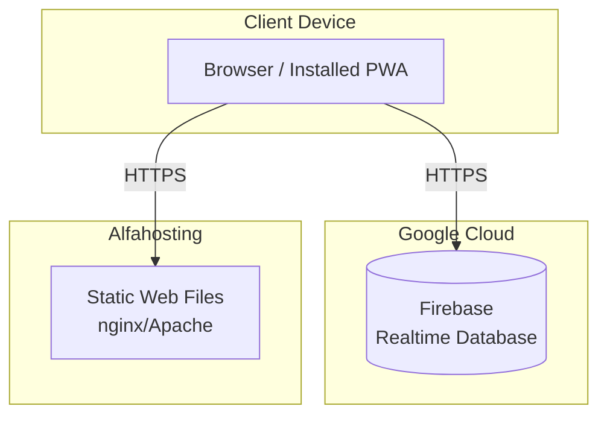

# 7. Deployment View

## 7.1 Infrastructure Overview


```mermaid
flowchart TB
    subgraph client [Client Device]
        browser[Browser / Installed PWA]
    end

    subgraph google [Google Cloud]
        firebase[(Firebase\nRealtime Database)]
    end

    subgraph alfahosting [Alfahosting]
        web[Static Web Files\nnginx/Apache]
    end

    browser -->|"HTTPS"| web
    browser -->|"HTTPS"| firebase
```

**Live URL:** `https://dabb.degler.info`

## 7.2 Hosting

| Component | Provider           | Details                                                     |
| --------- | ------------------ | ----------------------------------------------------------- |
| Web app   | Alfahosting (SFTP) | Static files, shared hosting, Apache — installable as a PWA |
| Backend   | Firebase RTDB      | Google-managed, `europe-west1` region                       |

No self-hosted server infrastructure. The game backend is Firebase Realtime Database only.

## 7.3 Architecture

The app is **serverless P2P**. All game state lives in Firebase RTDB as an append-only event log. Clients read and write events directly; no application server intermediary.

| Concern         | How handled                                                       |
| --------------- | ----------------------------------------------------------------- |
| Game state      | Firebase RTDB — append-only event log per session                 |
| Auth / identity | `secretId` stored in `localStorage`; SHA-256 hash stored in RTDB  |
| Write access    | Firebase security rules — only registered players can push        |
| Reconnection    | Replay all events from RTDB on reconnect                          |
| Session cleanup | Whichever client opens the lobby deletes waiting sessions >1h old |

## 7.4 Firebase Security Rules

There is no auth, so the rules are the whole access model. What they encode:

| Path                  | Rule                                                                                                                |
| --------------------- | ------------------------------------------------------------------------------------------------------------------- |
| `sessions/$code`      | Readable **by code only** — never at the root, or any visitor could read every player's hand                        |
| `sessions/$code`      | Deletable only while `status === 'waiting'` and older than 1h — this is the lobby's garbage collection              |
| `.../meta`            | Writable as a whole only while absent, because `createSession` writes it in one `set()`                             |
| `.../meta/players/$i` | Writable when free; while waiting also for a bot seat, a vacated seat, or by the owner echoing its own `secretHash` |
| `.../events/$eventId` | Writable only when `authorHash` matches one of the seats' `secretHash`                                              |
| `lobby/$code`         | World readable and writable — it holds no game state, only who is waiting for players                               |

The authoritative copy is [`database.rules.json`](../../database.rules.json); do not keep a second
one here. Note that the Playwright run does **not** exercise it — `playwright.config.ts` points the
emulator at the wide-open `database.rules.dev.json`, so a rules change has to be tried against the
real file by hand.

> **Note:** Event data in Firebase is readable by all session participants. Client-side filtering (`filterEventForPlayer` in `useGameState.ts`) hides opponents' cards in the UI, but raw events are readable from RTDB. This is an accepted trade-off for the serverless architecture.

## 7.5 CI/CD Pipeline

```
┌─────────────┐   ┌──────────┐   ┌────────────────┐   ┌──────────────────┐
│  Push/PR    │ → │  Build   │ → │ Security Scan  │ → │  Deploy Web      │
│  to main    │   │  & Test  │   │ (OSV Scanner)  │   │  (SFTP → Alpha.) │
└─────────────┘   └──────────┘   └────────────────┘   └──────────────────┘
```

- **CI** (`.github/workflows/ci.yml`): build all packages, lint, typecheck, test, bundle web client (Vite production build), run the Playwright E2E smoke test against the Firebase RTDB emulator
- **Deploy Web** (`.github/workflows/deploy-web.yml`): triggers after CI succeeds on `main`; builds web bundle with Firebase env vars baked in, deploys via FTPS to Alfahosting

Firebase env vars are stored as GitHub Actions repository variables (`EXPO_PUBLIC_FIREBASE_*` — kept from the pre-PWA naming so Vite's `envPrefix` config and the deploy pipeline didn't need renaming) and baked into the web bundle at build time.

## 7.6 Environment Variables (CI)

| Variable                                   | Where set            | Purpose                    |
| ------------------------------------------ | -------------------- | -------------------------- |
| `EXPO_PUBLIC_FIREBASE_API_KEY`             | GitHub repo variable | Firebase config            |
| `EXPO_PUBLIC_FIREBASE_AUTH_DOMAIN`         | GitHub repo variable | Firebase config            |
| `EXPO_PUBLIC_FIREBASE_DATABASE_URL`        | GitHub repo variable | Firebase RTDB URL          |
| `EXPO_PUBLIC_FIREBASE_PROJECT_ID`          | GitHub repo variable | Firebase config            |
| `EXPO_PUBLIC_FIREBASE_STORAGE_BUCKET`      | GitHub repo variable | Firebase config            |
| `EXPO_PUBLIC_FIREBASE_MESSAGING_SENDER_ID` | GitHub repo variable | Firebase config            |
| `EXPO_PUBLIC_FIREBASE_APP_ID`              | GitHub repo variable | Firebase config            |
| `SFTP_HOST`                                | GitHub secret        | Alfahosting SFTP server    |
| `SFTP_USER`                                | GitHub secret        | SFTP username              |
| `SFTP_PASSWORD`                            | GitHub secret        | SFTP password              |
| `SFTP_TARGET_DIR`                          | GitHub secret        | Target directory on server |

## 7.7 Local Development

For local development, create `apps/client/.env.local` with Firebase config values (copy from `deploy/.env.example`):

```bash
EXPO_PUBLIC_FIREBASE_API_KEY=...
EXPO_PUBLIC_FIREBASE_DATABASE_URL=...
# etc.
```

Then start the client:

```bash
pnpm --filter @dabb/client start
```

No local server needed — the app connects directly to Firebase RTDB.
